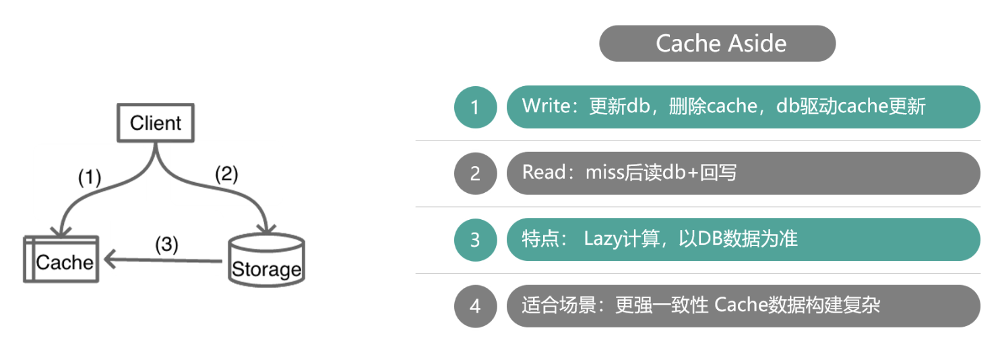
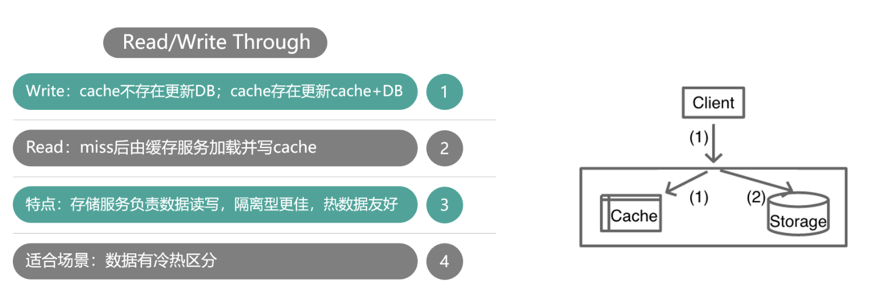

# 缓存分类及读写模式

* [读写模式](#读写模式)
* [缓存分类](#缓存分类)
## 读写模式
缓存的三种读写模式:
- Cache aside(旁路缓存)
- Read / write through(读写穿透)
- Write behind caching(缓存异步写入)

#### Cache aside(旁路缓存)

如图所示: 旁路缓存模式下，

- 写请求，更新db，删除cache，然后由db驱动更新cache
- 读请求，如果miss，读取db并回写cache

适用场景: 

- 没有专门的存储服务，同时对一致性要求比较高的业务
- 缓存更新比较复杂的业务

存在的问题:

- 业务系统需要同时维护cache和db两个数据存储

#### Read / write through(读写穿透)

如图所示，读写穿透模式下，

- 写请求,先检查cache是否存在
  - 如果不存在，不更新cache直接更新db;
  - 如果存在，先更新cache再同步更新db。
- 读请求
  - 如果不是热数据，则直接从db中加载
  - 如果是热数据，则先从db中加载到缓存，再读取

> 建议使用专门的缓存服务来处理

适用场景:

- 数据有冷热的区分，将热数据存放在cache中

  > 需要有一套缓存策略来决定哪些数据需要加入到缓存

#### Write behind caching(缓存异步写入)

如图所示，缓存异步写入模式下，

- 写请求，只更新缓存，然后异步更新db
- 读请求，读取缓存；如果miss，从db中加载并回写cache

适用场景:

- 写评率超高，需要合并数据

## 缓存分类

#### 按宿主层次分类

- 本地 Cache 是指业务进程内的缓存，这类缓存由于在业务系统进程内，所以读写性能超高且无任何网络开销，但不足是会随着业务系统重启而丢失。
- 进程间 Cache 是本机独立运行的缓存，这类缓存读写性能较高，不会随着业务系统重启丢数据，并且可以大幅减少网络开销，但不足是业务系统和缓存都在相同宿主机，运维复杂，且存在资源竞争。
- 远程 Cache 是指跨机器部署的缓存，这类缓存因为独立设备部署，容量大且易扩展，在互联网企业使用最广泛。不过远程缓存需要跨机访问，在高读写压力下，带宽容易成为瓶颈。

本地 Cache 的缓存组件有 Ehcache、Guava Cache 等，开发者自己也可以用 Map、Set 等轻松构建一个自己专用的本地 Cache。进程间 Cache 和远程 Cache 的缓存组件相同，只是部署位置的差异罢了，这类缓存组件有 Memcached、Redis、Pika 等。

#### 存储介质分类

- 内存型缓存将数据存储在内存，读写性能很高，但缓存系统重启或 Crash 后，内存数据会丢失。
- 持久化型缓存将数据存储到 SSD/Fusion-IO 硬盘中，相同成本下，这种缓存的容量会比内存型缓存大 1 个数量级以上，而且数据会持久化落地，重启不丢失，但读写性能相对低 1～2 个数量级。Memcached 是典型的内存型缓存，而 Pika 以及其他基于 RocksDB 开发的缓存组件等则属于持久化型缓存。