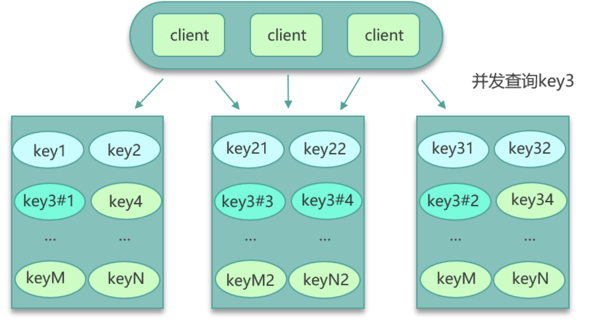
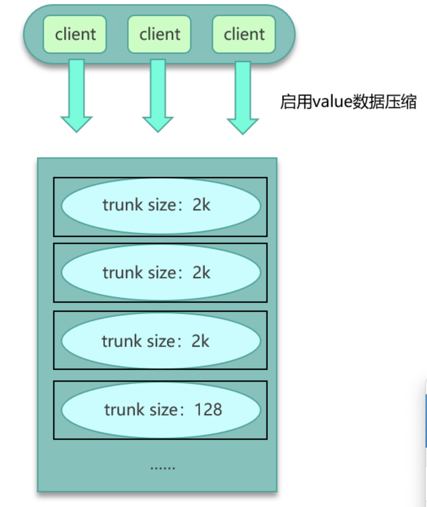
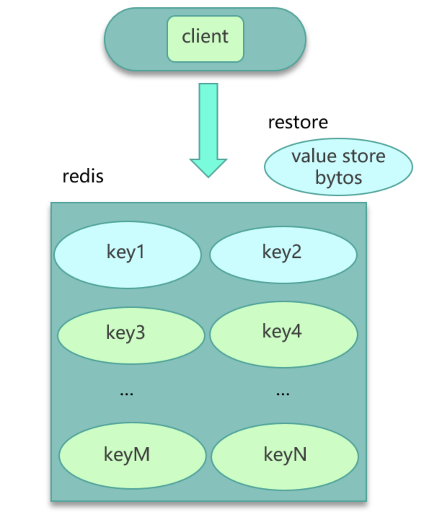
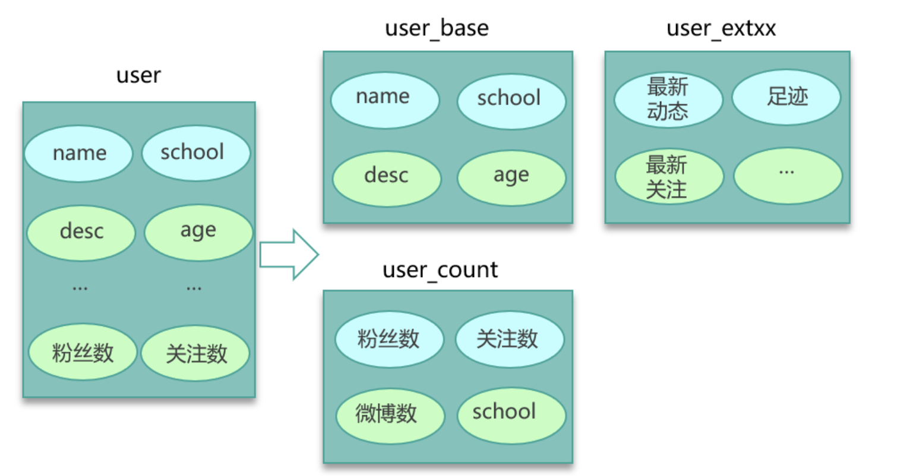

# 缓存经典问题

* [缓存穿透](#缓存穿透)
* [缓存雪崩](#缓存雪崩)
* [缓存失效](#缓存失效)
* [缓存不一致](#缓存不一致)
* [并发竞争](#并发竞争)
* [Hot Key](#Hot-Key)
* [Big Key](#Big-key)

## 缓存失效

缓存失效是由于**大量key同时过期**，请求直接从db加载导致db压力明显上升的问题。

缓存失效的问题主要是因为大量key有相同的过期时间导致，所以可以通过设计缓存过期时间，如**过期时间 = base时间 + 随机时间** 让数据在未来一段时间内慢慢过期，避免瞬时同时过期。

## 缓存穿透

缓存穿透是由某些特殊请求持续访问系统**不存在的key**，直接加载到db，导致db压力上升，从而影响正常业务的现象。

对于缓存穿透可以通过如下两种方案解决:

- 查询这些不存在的数据时，第一次查询DB，虽然没查询到结果返回NULL，但仍记录这些key到缓存，并将这些key对应的value设置成一个特殊值。

  > Warning: 这种方式会导致缓存中存在大量无用key的问题，对此可以采用将这些key设置一个比较短的过期时间或分配一个独立缓存专门存放这些key。对于独立缓存在读取时，先查询正常缓存是否命中，没有命中再查询独立缓存，如果独立缓存还没命中，再加载DB。

- 构建一个bloom filter缓存过滤器，记录全量数据，这样访问数据时，可以直接通过bloom filter判断这个key是否存在，如果不存在直接返回即可，根本不需要查询缓存或DB。

  > BloomFilter 要缓存全量的 key，这就要求全量的 key 数量不大，10亿 条数据以内最佳，因为 10亿 条数据大概要占用 1.2GB 的内存。也可以用 BloomFilter 缓存非法 key，每次发现一个 key 是不存在的非法 key，就记录到 BloomFilter 中，这种记录方案，会导致 BloomFilter 存储的 key 持续高速增长，为了避免记录 key 太多而导致误判率增大，需要定期清零处理。

## 缓存雪崩

缓存雪崩是指部分缓存节点不可用导致缓存服务甚至整个服务系统不可用的情况。缓存雪崩按照缓存是否rehash(即是否漂移)分为两种情况:

- **不支持rehash导致的不可用** 一般是由于缓存节点不可用，请求穿透到db导致db也过载，最终整个系统不可用
- **支持rehash导致的不可用** 大多跟流量洪峰有关，流量洪峰到达，引发部分缓存节点过载 Crash，然后因 rehash 扩散到其他缓存节点，最终整个缓存体系异常。

对于缓存雪崩可以通过如下方案解决:

- 对业务DB的访问添加读写开关，当发现DB请求变慢、阻塞，满请求超过阈值时，就关闭读开关，部分或所有读DB的请求进行failfast立即返回，待DB恢复后再打开读开关
- 对缓存增加多个副本，缓存异常或请求miss后，再读取其他缓存副本，而且多个缓存副本尽量部署在不同机架，从而确保在任何情况下，缓存系统都会正常对外提供服务。
- 对缓存体系进行实时监控，当请求访问的慢速比超过阀值时，及时报警，通过机器替换、服务替换进行及时恢复；也可以通过各种自动故障转移策略，自动关闭异常接口、停止边缘服务、停止部分非核心功能措施，确保在极端场景下，核心功能的正常运行。

## 缓存不一致

同一份数据，可能会同时存在 DB 和缓存之中。那就有可能发生，DB 和缓存的数据不一致。如果缓存有多个副本，多个缓存副本里的数据也可能会发生不一致现象。

不一致的问题大多跟缓存更新异常有关。比如更新 DB 后，写缓存失败，从而导致缓存中存的是老数据。另外，如果系统采用一致性 Hash 分布，同时采用 rehash 自动漂移策略，在节点多次上下线之后，也会产生脏数据。缓存有多个副本时，更新某个副本失败，也会导致这个副本的数据是老数据。

要尽量保证数据的一致性。这里也给出了 3 个方案，可以根据实际情况进行选择。

- 第一个方案，cache 更新失败后，可以进行重试，如果重试失败，则将失败的 key 写入队列机服务，待缓存访问恢复后，将这些 key 从缓存删除。这些 key 在再次被查询时，重新从 DB 加载，从而保证数据的一致性。
- 第二个方案，缓存时间适当调短，让缓存数据及早过期后，然后从 DB 重新加载，确保数据的最终一致性。
- 第三个方案，不采用 rehash 漂移策略，而采用缓存分层策略，尽量避免脏数据产生。

## 并发竞争

数据并发竞争，是指在高并发访问场景，一旦缓存访问没有找到数据，大量请求就会并发查询 DB，导致 DB 压力大增的现象。

数据并发竞争，主要是由于多个进程/线程中，有大量并发请求获取相同的数据，而这个数据 key 因为正好过期、被剔除等各种原因在缓存中不存在，这些进程/线程之间没有任何协调，然后一起并发查询 DB，请求那个相同的 key，最终导致 DB 压力大增

要解决并发竞争，有 2 种方案。

- 方案一是使用全局锁
- 对缓存数据保持多个备份，即便其中一个备份中的数据过期或被剔除了，还可以访问其他备份，从而减少数据并发竞争的情况

## Hot Key

而在突发事件发生时，大量用户同时去访问这个突发热点信息，访问这个 Hot key，这个突发热点信息所在的缓存节点就很容易出现过载和卡顿现象，甚至会被 Crash。

如何发现及预估Hot Key

- 提前评估出可能的热 key
- 可以通过 Spark，对应流任务进行实时分析，及时发现新发布的热点 key
- 对于之前已发出的事情，逐步发酵成为热 key 的，则可以通过 Hadoop 对批处理任务离线计算，找出最近历史数据中的高频热 key。

找到Hot Key后，可以有以下解决方案:

- 对Hot Key分散处理，比如一个热 key 名字叫 hotkey，可以被分散为 hotkey#1、hotkey#2、hotkey#3，……hotkey#n，这 n 个 key 分散存在多个缓存节点，然后 client 端请求时，随机访问其中某个后缀的 hotkey，这样就可以把热 key 的请求打散，避免一个缓存节点过载，如下图所示:

- key 的名字不变，对缓存提前进行多副本+多级结合的缓存架构设计
- 如果热 key 较多，还可以通过监控体系对缓存的 SLA 实时监控，通过快速扩容来减少热 key 的冲击
- 业务端还可以使用本地缓存，将这些热 key 记录在本地缓存，来减少对远程缓存的冲击。

## Big Key

Big key也就是大 Key 的问题。大 key，是指在缓存访问时，部分 Key 的 Value 过大，读写、加载易超时的现象。

对于大 key，给出 3 种解决方案。

- 如果数据存在 Mc 中，可以设计一个缓存阀值，当 value 的长度超过阀值，则对内容启用压缩，让 KV 尽量保持小的 size，其次评估大 key 所占的比例，在 Mc 启动之初，就立即预写足够数据的大 key，让 Mc 预先分配足够多的 trunk size 较大的 slab。确保后面系统运行时，大 key 有足够的空间来进行缓存。  

- 如果数据存在 Redis 中，比如业务数据存 set 格式，大 key 对应的 set 结构有几千几万个元素，这种写入 Redis 时会消耗很长的时间，导致 Redis 卡顿。此时，可以扩展新的数据结构，同时让 client 在这些大 key 写缓存之前，进行序列化构建，然后通过 restore 一次性写入，如下图所示。

- 将大 key 分拆为多个 key，尽量减少大 key 的存在。同时由于大 key 一旦穿透到 DB，加载耗时很大，所以可以对这些大 key 进行特殊照顾，比如设置较长的过期时间，比如缓存内部在淘汰 key 时，同等条件下，尽量不淘汰这些大 key。

