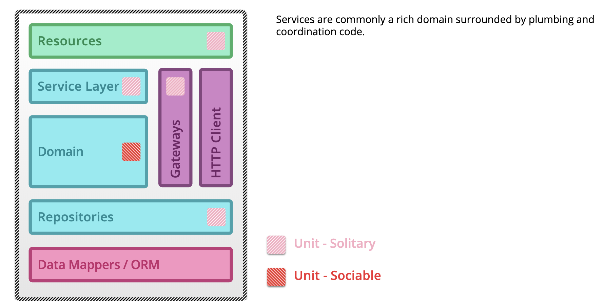

## UNIT TEST

作为一个开发人员，在项目过程中总会被要求到写单元测试，试图通过单元测试来保证新功能的覆盖率，从而保证功能的正确性。那么，在项目中应该如何来写单元测试？怎样的单元测试才能保证覆盖率或者功能的正确性呢？作为一个写测试经验不是很丰富的我来说，这一点还是比较困惑的，最近看过很多相关的文章，在这里稍作总结。

#### 何为单元测试?

对于这个问题，在martin关于[微服务如何写测试](https://martinfowler.com/articles/microservice-testing/)中找到一张图，我觉得可以很好的描述这个问题。

​		

​		**单元测试**: 对软件中**最小可测试部分**进行测试，并验证其行为是否符合预期。

> *A unit test exercises the smallest piece of testable software in the application to determine whether it behaves as expected*

​		**最小可测试部分**: 通常是指某个类或相关联的几个类的级别上。

#### Sociable unit testing

​		Sociable unit testing 从测试的角度来说比较关注某个功能的整体行为，即从对外暴露的接口开始，将提供整个功能的所有类当做一个测试单元(黑盒)来进行测试。

​		从这个概念上来讲，我认为，Sociable unit testing的着重点在于**功能的整体行为**上，我们的测试应能够很好的说明某个功能具备的行为。

####Solitary unit testing 

​		Solitary unit testing 更加关注在某个类的内部行为以及和它交互的依赖上，并通过**[test doubles](http://xunitpatterns.com/Test%20Double.html)**来帮助我们解决在测试时与依赖的解耦。

#### 何时使用Sociable,何时使用Solitary?

#### TDD(test driven development) 与 self-testing code

- TDD遵循三步:
  - Write a test for the next bit of functionality you want to add.
  - Write the functional code until the test passes.
  - Refactor both new and old code to make it well structured.
- TDD 与self-testing code的异同
  - 两者都关注在测试代码覆盖整个项目的功能
  - 两者都能对项目的重构提供优势
  - 区别点在于TDD是先写测试再写功能代码，而self-testing code在测试和功能代码的书写顺序上并没有严格的要求

#### 参考资料

- [Martin Unit test](https://martinfowler.com/bliki/UnitTest.html)
- [Martin SelfTestingCode](https://martinfowler.com/bliki/SelfTestingCode.html)
- [Martin TDD](https://martinfowler.com/bliki/TestDrivenDevelopment.html)
- [Marin 微服务中的测试](https://martinfowler.com/articles/microservice-testing)
- [Test Doubles](http://xunitpatterns.com/Test%20Double.html)
- [Xunit](https://martinfowler.com/bliki/Xunit.html)